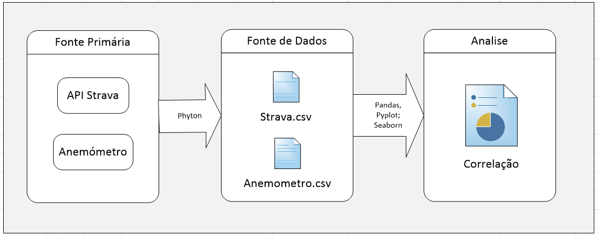
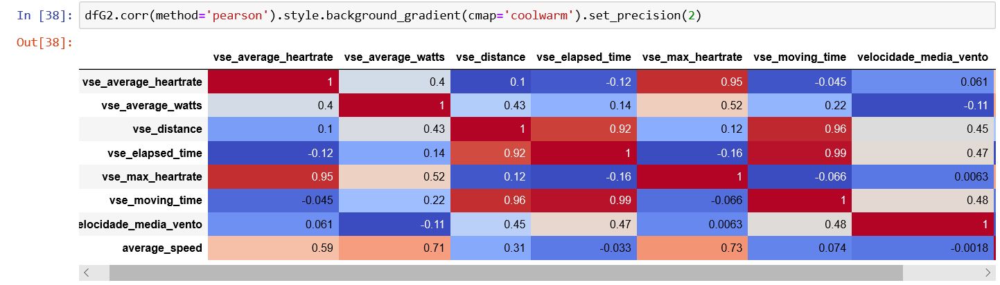

# Mineração e Analise de dados do Strava
Python/Pandas/Pyplot/seaborn

## Motivação
Em minhas atividades ciclisticas é notável a diferença do esforço fisíco necessário para performar quando a direção do vento esta desfavorável, foi por isso que a curiosidade me levou a explorar o quanto isso é impactante em minha performance geral e em especial na media de batimento cardiaco e de pontencia/watts

## Principais Desafio
Consumir a API do *Strava por segmento determinando o angulo e consequentemente a direção tomada para cada um; Transformar dados disponibilizados pelo anemômetro a a fim de encontrar a velocidade, direçãom e força do vento

*Strava (Aplicativo de monitoria de atividade fisica) https://developers.strava.com/docs/reference/

*Anemômetro - http://www.rodosol.com.br/_util/anemometro/index.html

## Abordagem
1. API do Strava
    - Extrair Dados e transformar dados dos segmentos pela API via phyton;
    - Determinar o angulo do vento em função da latitude e longitude;
    - Determinar a quantidade de calorias queimadas por meio da conversão de kilojaules;
    - Remover colunas desnecessárias;
    - Analise exploratoria dos dados via Pandas/Seaborn

2. Anemômetro
    - Extrair e transformar dados do arquivo contendo as informações climáticas pelo Pandas;
    - Agrupar dados para obter a média e direção da velocidade do vento;
    - Analise exploratoria dos dados via Pandas
  
3. Cruzar dados dos segmentos do Strava aos dados climáticos obtidos pelo anemômetro;
4. Filtrar apenas segmentos cujo a direção dos ventos seja oposta a direção dos ventos obtidos pelo anemômetro;
6. Remover todas as variaveis que não são de interese;
5. Correlacionar Váriaveis.
  
## Solução

Analisar o coeficiente de correlação de person do dados obtidos finais a fim de identificar possíveis relações fortes que podem comprovar a hipotese inicial

## Estruturação Resumida da Solução

	

	
</p

Infelizmente os dados podem estar enviezados, já que os únicos dados de monitoria meteorologica minimamente estruturados (que é uma das variaveis alvo) foi obtida por um instrumento que esta localizado em um dos únicos dois pontos que apresentam predominancia de ventos muito discrepamente do resto de Vitória/Vila Velha

